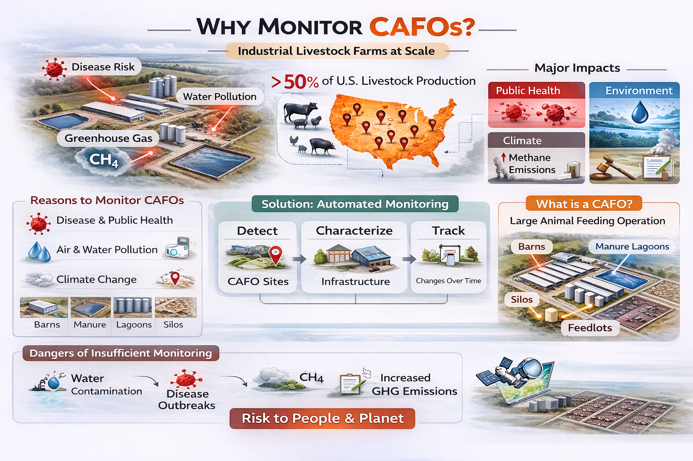
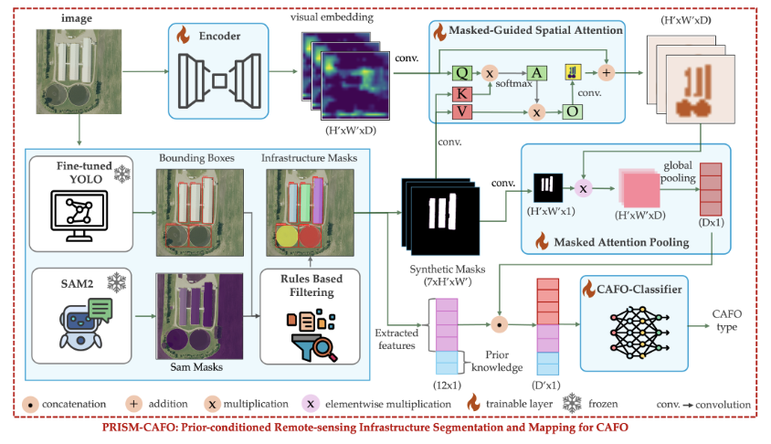
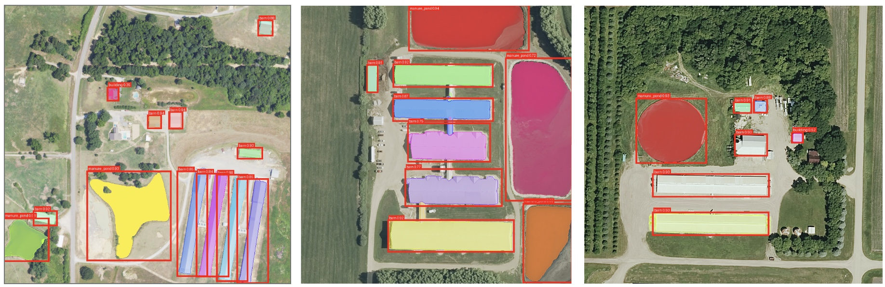
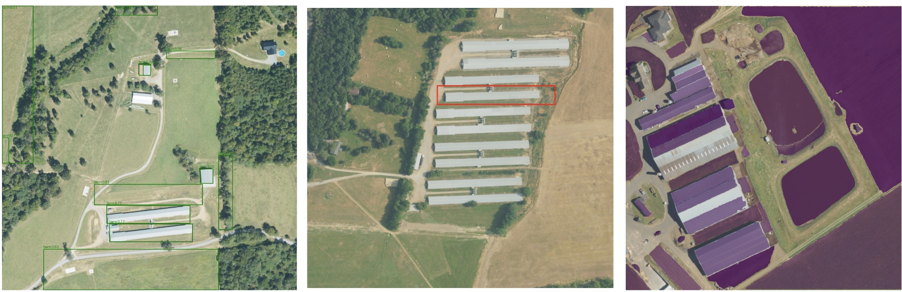
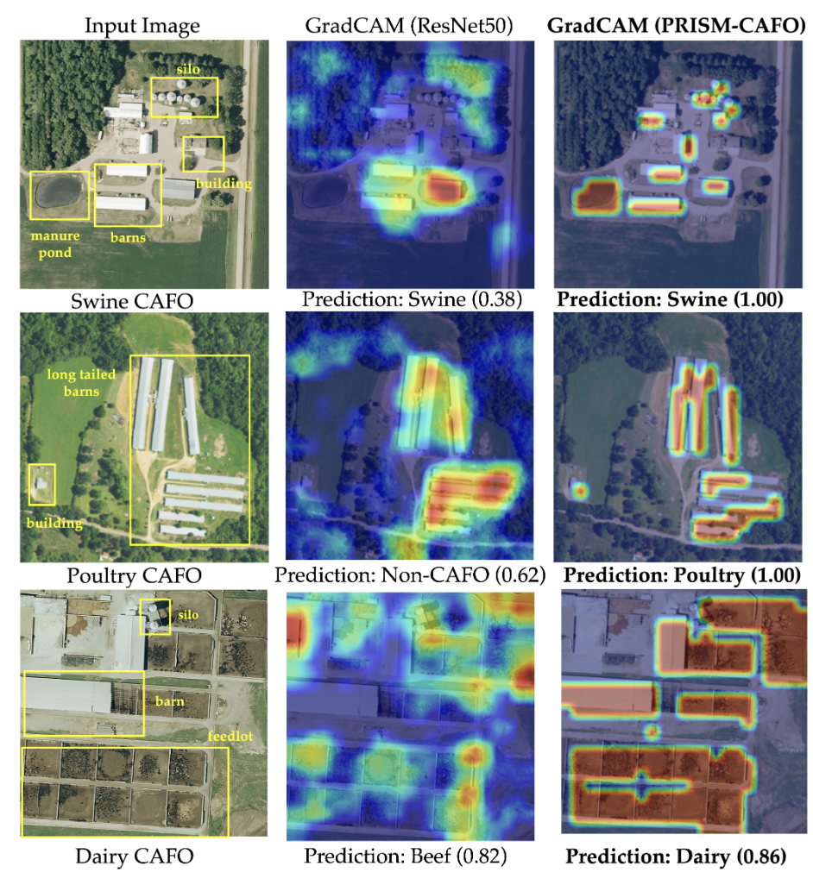

# 🐄 PRISM-CAFO  
## Prior-conditioned Remote-sensing Infrastructure Segmentation & Mapping for CAFOs

<p align="center">
  
</p>

<p align="center">
<b>Scalable • Explainable • Infrastructure-aware AI for Livestock Facility Mapping</b>
</p>

<p align="center">
<a href="https://arxiv.org/abs/2601.11451"></a>


</p>

---

## 🌎 Motivation
Concentrated Animal Feeding Operations (CAFOs) significantly impact environmental sustainability, water quality, and public health—yet **large-scale monitoring of livestock infrastructure remains limited**.

PRISM-CAFO introduces an **infrastructure-first, explainable** remote-sensing pipeline that detects, segments, and reasons over *facility infrastructure* (barns, lagoons, feedlots) to identify CAFOs at scale.

---

## 💡 Core Idea
Instead of treating CAFO identification as pure image classification:

> **Detect infrastructure → segment objects → extract descriptors → classify → explain**

This yields improved interpretability and robustness across regions.

---

## 🧠 Method Overview

<p align="center">
  
</p>

### Pipeline
1. **Infrastructure Detection (YOLO)**: detect candidate barns/lagoons/feedlots  
2. **Segmentation (SAM)**: refine to pixel-accurate masks  
3. **Descriptor Extraction**: counts, areas, shapes, and spatial layout features  
4. **Multimodal Prediction**: fuse visual + structured descriptors  
5. **Explainability**: attribution highlights decisive infrastructure cues  

---

## 🖼 Visual Results

### Infrastructure Detection
<p align="center">

</p>

### Segmentation (SAM)
<p align="center">

</p>

### Outputs: Explainable Mapping
<p align="center">

</p>

---

## 📂 Repository Structure
```text
PRISM-CAFO/
├── datas/                      # dataset + metadata
├── model/                      # trained weights
├── main.py                     # main pipeline
├── train_yolo.py               # infrastructure detector training
├── train_multiclass_v2.py      # CAFO classifier training
├── runPredict.py               # inference
├── run_sam_on_yolo.ipynb       # segmentation notebook
├── filtering_components.ipynb
└── docs/                       # README visuals
```

(Structure verified from the GitHub repository file tree.) 

---

## ⚙️ Installation

### Create environment
```bash
conda create -n prism_cafo python=3.10 -y
conda activate prism_cafo
```

### Install dependencies
```bash
pip install torch torchvision
pip install ultralytics
pip install segment-anything
pip install opencv-python matplotlib rasterio tqdm
```

> If you run on HPC: install a CUDA-matching PyTorch build and ensure your CUDA runtime is visible.

---

## 🚀 Training

### Train infrastructure detection model
```bash
python train_yolo.py
```

### Train CAFO classifier
```bash
python train_multiclass_v2.py
```

---

## 🔍 Inference
```bash
python runPredict.py
```

SAM segmentation notebook:
```text
run_sam_on_yolo.ipynb
```

---

## 📚 Paper
**PRISM-CAFO: Prior-conditioned Remote-sensing Infrastructure Segmentation and Mapping for CAFOs** (WACV 2026)  
arXiv: https://arxiv.org/abs/2601.11451 

---

## 👥 Authors
Oishee Bintey Hoque • Nibir Chandra Mandal • Kyle Luong • Mandy Wilson • Samarth Swarup • Madhav Marathe • Abhijin Adiga

---

## ⭐ Citation
```bibtex
@inproceedings{prismcafo2026,
  title={PRISM-CAFO: Prior-conditioned Remote-sensing Infrastructure Segmentation and Mapping for CAFOs},
  author={Hoque, Oishee and Mandal, Nibir and others},
  booktitle={WACV},
  year={2026}
}
```

---

## 🔮 Roadmap
- [ ] Release pretrained models  
- [ ] Release benchmark data splits  
- [ ] Interactive mapping dashboard  
- [ ] Temporal change detection  

---

## 🙏 Acknowledgements
Developed at the Biocomplexity Institute, University of Virginia.
